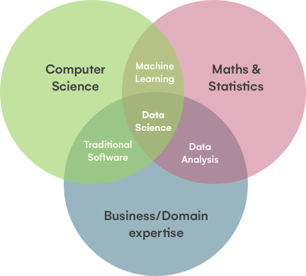

## C'est quoi la Data Science

La data science est un domaine qui s'intéresse à l'extraction de connaissances à partir de données. Il utilise des techniques statistiques, mathématiques et informatiques pour analyser, interpréter et modéliser des données.

 

La data science est utilisée dans plusieurs domaines tels que la finance, la santé, la vente au détail, le marketing, les transports et bien d'autres. C'est devenu de plus en plus important à mesure que la quantité de données générées par la technologie moderne continue de croître.

 

## Les différentes étapes d'un projet de Data Science

### Collecte de données 

Le premier pas dans le processus de data science est de collecter des données. Les données peuvent provenir de différentes sources telles que des fichiers, des bases de données, des capteurs, des sondages, des enregistrements de transactions, des images, etc. Il est important de choisir des données de qualité qui sont pertinentes pour le problème que vous souhaitez résoudre.

 

Par exemple, pour prédire si un client d'une entreprise va acheter un produit, vous pouvez collecter des données sur les achats passés, les préférences de produits, les habitudes de navigation en ligne, les interactions avec la marque sur les réseaux sociaux, etc.

### Exploration des données

Une fois les données collectées, il est important de les explorer pour comprendre leur nature, leur qualité et leur contenu. Cette étape permet de détecter les valeurs manquantes, les données aberrantes, les corrélations, les distributions, etc. Cela peut se faire en utilisant des outils statistiques et graphiques.

 

Par exemple, pour comprendre les habitudes d'achat des clients, vous pouvez visualiser la distribution des prix d'achat, la corrélation entre l'âge et le montant d'achat, ou encore la fréquence d'achat selon le canal de vente.

### Types de données

Les données sont le fondement de la data science, et elles peuvent être de différents types. Comprendre la nature des données est important pour choisir les méthodes d'analyse appropriées.

#### Données numériques

Les données numériques sont des nombres, et peuvent être continues ou discrètes. Les données continues peuvent prendre n'importe quelle valeur dans un intervalle donné, tandis que les données discrètes sont limitées à des valeurs entières. Les données numériques peuvent être utilisées pour mesurer des grandeurs physiques, financières, ou pour quantifier des caractéristiques. Exemples :

- La température en degrés Celsius est une donnée numérique continue.
- Le nombre de produits vendus est une donnée numérique discrète.
- Le montant d'une transaction financière est une donnée numérique continue.

#### Données catégorielles

Les données catégorielles sont des valeurs qui peuvent être regroupées en catégories. Elles peuvent être nominales ou ordinales. Les données catégorielles sont souvent utilisées pour décrire des caractéristiques qualitatives. Exemples :

- La couleur des yeux est une donnée catégorielle nominale.
- La taille des vêtements est une donnée catégorielle ordinale.
- La marque d'un produit est une donnée catégorielle nominale.

#### Données temporelles

Les données temporelles sont des valeurs qui décrivent des moments dans le temps. Elles peuvent être des instants précis, des périodes, ou des fréquences. Les données temporelles sont souvent utilisées pour analyser des phénomènes qui évoluent dans le temps. Exemples :

- La date de naissance est une donnée temporelle de type instant.
- La durée d'une période de vente est une donnée temporelle de type période.
- La fréquence d'achat est une donnée temporelle de type fréquence.

#### Données textuelles

Les données textuelles sont des valeurs qui décrivent du texte. Elles peuvent être des phrases, des paragraphes, ou des documents entiers. Les données textuelles sont souvent utilisées pour analyser le langage naturel, ou pour extraire des informations de textes non structurés. Exemples :

- Les avis des clients sur un produit sont des données textuelles.
- Les descriptions des produits dans un catalogue sont des données textuelles.
- Les articles de journaux sont des données textuelles.

#### Données géospatiales

Les données géospatiales sont des valeurs qui décrivent des positions dans l'espace. Elles peuvent être des coordonnées géographiques, des adresses, ou des noms de lieux. Les données géospatiales sont souvent utilisées pour cartographier des données, ou pour analyser des phénomènes qui varient dans l'espace. Exemples :

- Les adresses des clients sont des données géospatiales.
- Les coordonnées GPS d'un point de vente sont des données géospatiales.
- Les noms de villes dans un tableau de données sont des données géospatiales.

#### Données en images

Les données en images sont des valeurs qui décrivent des images. Elles sont souvent stockées sous forme de pixels qui représentent les couleurs ou les niveaux de gris des différents points de l'image. Les données en images sont souvent utilisées dans des applications telles que la reconnaissance d'objets, la détection de fraudes et la surveillance. Exemples :

- Les images médicales sont des données en images, comme les radiographies et les IRM.
- Les images satellites sont des données en images qui peuvent être utilisées pour cartographier les zones géographiques et surveiller les changements dans les environnements naturels.
- Les images de surveillance de la circulation routière sont des données en images qui peuvent être utilisées pour détecter les violations du code de la route.

#### Données en audio 

Les données en audio sont des valeurs qui décrivent des enregistrements sonores. Elles peuvent être stockées sous forme de signaux numériques qui représentent la fréquence et l'amplitude du son à différents moments. Les données en audio sont souvent utilisées dans des applications telles que la reconnaissance vocale, la détection de fraudes et la surveillance. Exemples :

- Les enregistrements de voix sont des données en audio qui peuvent être utilisées pour la reconnaissance vocale, telle que la conversion de la parole en texte.
- Les enregistrements de musique sont des données en audio qui peuvent être utilisées pour la recommandation de musique et la classification de genres musicaux.
- Les enregistrements de surveillance audio sont des données en audio qui peuvent être utilisées pour détecter les menaces et les comportements suspects.

En tant que data scientist, il est important de comprendre les différents types de données, car cela peut avoir une incidence sur les méthodes de collecte, de stockage, de traitement et d'analyse. En fonction des données, les algorithmes de machine learning et les outils d'analyse peuvent varier considérablement.

### Sélection de caractéristiques 

Si le nombre de caractéristiques est très élevé, il peut être judicieux de sélectionner les caractéristiques les plus importantes pour améliorer l'efficacité du modèle.

### Séparation des données 
Les données doivent être divisées en deux parties, l'ensemble d'entraînement et l'ensemble de test. L'ensemble d'entraînement est utilisé pour entraîner le modèle et l'ensemble de test est utilisé pour évaluer les performances du modèle.

### Construction de notre modèle (IA)

Une fois les données nettoyées et prétraitées, il est temps de choisir un modèle d'IA et de l'entraîner sur l'ensemble d'entraînement. Le choix du modèle dépend du type de problème à résoudre et du type de données.

 

L'intelligence artificielle (IA) est un domaine de l'informatique qui vise à créer des machines capables de réaliser des tâches qui nécessitent normalement l'intelligence humaine. Cette discipline est basée sur le développement de programmes informatiques qui peuvent apprendre et s'adapter à de nouvelles situations, et ainsi exécuter des tâches sans intervention humaine.

 

 Il existe plusieurs modes d'apprentissage :

- **Le Machine Learning** (apprentissage automatique en français) est une branche de l'intelligence artificielle qui se concentre sur l'apprentissage de modèles à partir de données, afin de réaliser des tâches de prédiction ou de classification. Les modèles peuvent être entraînés à l'aide de différentes techniques, notamment l'apprentissage supervisé (où les données sont étiquetées pour indiquer la réponse souhaitée) et l'apprentissage non supervisé (où les données ne sont pas étiquetées). Le Machine Learning est utilisé dans de nombreux domaines, notamment la reconnaissance vocale, la reconnaissance d'images, la recommandation de produits et la détection de fraudes.

- **Le Reinforcement Learning** (apprentissage par renforcement en français) est une branche spécifique du Machine Learning qui se concentre sur l'apprentissage par essais et erreurs. Dans ce type d'apprentissage, un agent est placé dans un environnement et doit apprendre à prendre des décisions pour maximiser une récompense. L'agent prend une action, reçoit une récompense ou une pénalité, et utilise cette information pour ajuster sa stratégie. Le Reinforcement Learning est utilisé pour des applications comme les jeux vidéo, les robots, et les systèmes de recommandation personnalisée.

- **Le Deep Learning** (apprentissage profond en français) est une sous-branche du Machine Learning qui utilise des réseaux de neurones artificiels pour apprendre à partir de données. Les réseaux de neurones artificiels sont des modèles computationnels qui sont conçus pour imiter le fonctionnement du cerveau humain. Les réseaux de neurones sont composés de plusieurs couches, chacune traitant une partie de l'information en entrée pour produire une sortie. Le Deep Learning est utilisé dans de nombreux domaines, notamment la reconnaissance vocale, la reconnaissance d'images, la traduction automatique et la reconnaissance de caractères manuscrits.

### Évaluation du modèle 

Après l'entraînement du modèle, il est important d'évaluer sa performance sur l'ensemble de test. Il existe de nombreuses mesures pour évaluer les performances d'un modèle, telles que l'exactitude, la précision, le rappel et le F1-score.

### Optimisation du modèle 

Si les performances du modèle ne sont pas satisfaisantes, il peut être nécessaire de le réajuster ou de régler ses paramètres pour améliorer ses performances.

### Déploiement du modèle

Une fois que le modèle a été entraîné et évalué avec succès, il peut être déployé dans un environnement de production. Cela peut inclure l'intégration du modèle dans une application ou un système existant.
